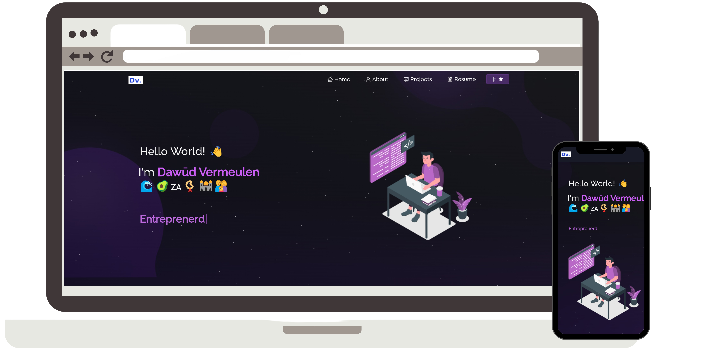

<h2 align="center">
  Dawūd Vermeulen — Portfolio (v3.0)<br/>
  <a href="https://dawudvermeulen.vercel.app/" target="_blank">dawudvermeulen.vercel.app</a>
</h2>
<div align="center">
  
</div>

## TL;DR

Personal portfolio of **Dawūd Vermeulen** — software tester & developer based in Cape Town, South Africa.

## ✨ Features

- 🌌 Pure-CSS animated starfield (no canvas, no JS particles)
- 📄 In-browser PDF resume viewer + download
- 📱 Fully responsive (320px → 4K), hamburger nav on mobile
- ♿ A11y-first: skip-to-content link, semantic landmarks, focus rings, WCAG AA contrast
- 🚀 Vite-powered: fast dev server, tiny prod bundle
- 🎨 CSS Modules + design tokens — change colors in one file

## 🛠 Tech Stack

| Layer       | Tool                                |
| ----------- | ----------------------------------- |
| Framework   | React 18                            |
| Build       | Vite 5                              |
| Styling     | CSS Modules + CSS custom properties |
| Routing     | react-router-dom v6                 |
| PDF viewer  | react-pdf v9                        |
| Icons       | react-icons v5                      |
| Lint/Format | ESLint + Prettier                   |
| Hosting     | Vercel                              |

## 🎨 Color Palette (Indigo / Lavender)

| Role            | Hex       |
| --------------- | --------- |
| Body background | `#0A0F1A` |
| Surface         | `#111827` |
| Primary accent  | `#473bf0` |
| Mid accent      | `#6665dd` |
| Secondary       | `#9b9ece` |
| Muted           | `#acadbc` |
| Text primary    | `#F3F4F6` |
| Text secondary  | `#9CA3AF` |

### How to change colors

All colors are CSS custom properties defined in **one file**: `src/styles/tokens.css`. Edit the variables there and the entire site updates.

## 📄 How to update the resume PDF

1. Replace the file at `/src/Assets/Dawūd_Vermeulen.pdf` with a new PDF (keep the filename).
2. That's it — the viewer and both download buttons import from this path.

If you change the filename, update the import in `src/components/Resume/ResumeNew.jsx`.

## 🚀 Getting started

```bash
npm install      # one-time install
npm run dev      # local dev server at http://localhost:3000
npm run build    # production build → /build
npm run preview  # preview the production build
npm run lint     # ESLint
npm run format   # Prettier
npm run images   # Re-convert PNGs in src/Assets/Projects/ → WebP
```

## 📁 Project structure

```text
src/
├── main.jsx                # Entry (createRoot)
├── App.jsx                 # Root + router
├── styles/
│   ├── tokens.css          # Design tokens (colors, spacing, motion)
│   └── global.css          # Resets, body, focus rings, scrollbar
├── components/
│   ├── Stars.{jsx,module.css}     # Pure-CSS starfield
│   ├── Navbar.{jsx,module.css}
│   ├── Footer.{jsx,module.css}
│   ├── Preloader.{jsx,module.css}
│   ├── ScrollToTop.jsx
│   ├── Home/   (Home, Home2, Type) + Home.module.css
│   ├── About/  (About, AboutCard, Github, Techstack, Toolstack) + About.module.css
│   ├── Projects/ (Projects, ProjectCards) + Projects.module.css
│   └── Resume/   (ResumeNew) + Resume.module.css
└── Assets/                 # PDF, SVGs, project screenshots (WebP)
```

## 📜 Credits & License

Originally bootstrapped from the MIT-licensed [soumyajit4419/Portfolio](https://github.com/soumyajit4419/Portfolio) template; the v3.0 codebase has been substantially rewritten (Vite migration, CSS Modules, design-token system, custom accessible navbar, pure-CSS starfield, lazy-loaded PDF route, full lint/format toolchain).

Released under the [MIT License](./LICENSE).
